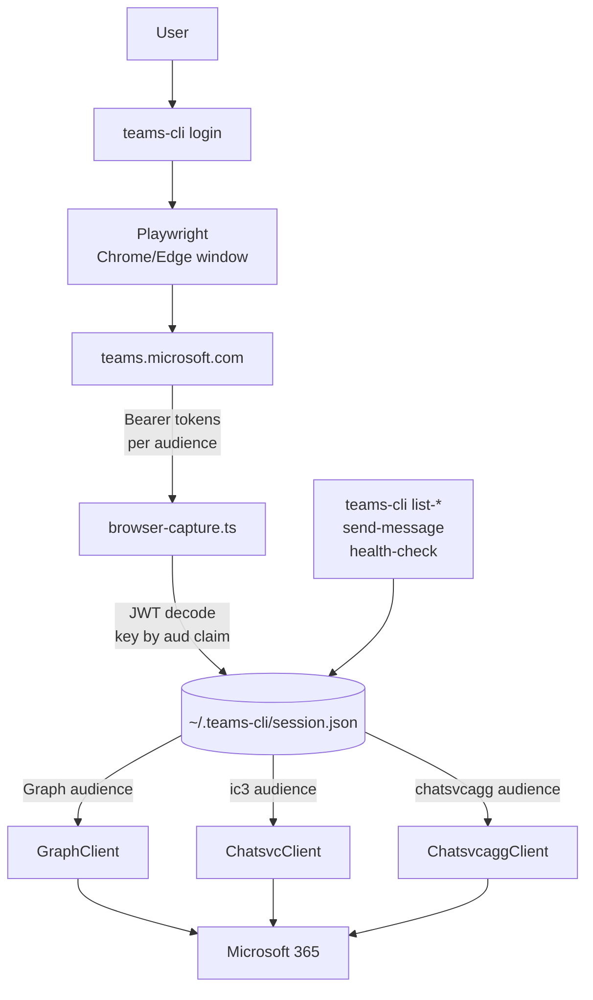

# teams-cli

Command-line access to Microsoft Teams through a captured Teams-web Bearer token, plus the engine behind the `teams-bridge` MCP server.

[](https://github.com/weirdapps/teams-access/actions/workflows/ci.yml)
[](https://github.com/weirdapps/teams-access/actions/workflows/sonarcloud.yml)
[](https://sonarcloud.io/project/overview?id=weirdapps_teams-access)
[](https://opensource.org/licenses/MIT)
[](https://nodejs.org/)

## What it is

`teams-cli` signs you in to `teams.microsoft.com` through a real Chrome or Edge window driven by Playwright, captures every Bearer token the Teams SPA acquires (Microsoft Graph, `chatsvc`, `chatsvcagg`, IC3, presence, Skype spaces), keys them by JWT `aud` claim, and dispatches each subsequent request to the right audience. Structural reads (teams you belong to, channels of a team) go through Microsoft Graph. Message content (chat list, chat messages, channel posts) goes through the private `chatsvc` and `chatsvcagg` services because the Teams-web Graph token does not carry `Chat.Read*` or `ChannelMessage.Read.All` scopes on enterprise tenants with restrictive policies. See [`docs/spike-results.md`](docs/spike-results.md) for the full scope analysis.

No app registration, no admin consent, no tenant-side setup. The tool consumes the same tokens the web client already has.

Every command emits a single JSON object to stdout and a non-zero exit code on failure, so it composes cleanly with shell pipelines and MCP wrappers.

Sister project: [`outlook-access`](https://github.com/weirdapps/outlook-access) (same capture pattern, same session file layout, same exit codes).

## Who it is for

- Developers building integrations that need read access to a real Teams inbox and send access to chats, without waiting for their tenant admin to consent to a first-party app
- The `teams-bridge` MCP server bundled inside the `chat` plugin of [`plessas-marketplace`](https://github.com/weirdapps/plessas-marketplace), which shells out to `node dist/cli.js` from this repo. Building this repo is the prerequisite for the MCP wrapper

## CLI commands

Ten subcommands, all listed by `teams-cli --help`:

| Command         | Backend                                | Purpose                                                       |
| --------------- | -------------------------------------- | ------------------------------------------------------------- |
| `login`         | Playwright capture                     | Interactive sign-in, persists per-audience Bearers            |
| `auth-check`    | Graph `/me`                            | Verify the cached session is still accepted                   |
| `auth-renew`    | Playwright headless                    | Silent re-issue against the persisted profile                 |
| `list-teams`    | Graph `/me/joinedTeams`                | Teams you belong to                                           |
| `list-channels` | Graph `/teams/{id}/channels`           | Single team (`--team-id`) or fan out (`--all-teams`)          |
| `list-chats`    | chatsvcagg `/updates`                  | 1:1, group, meeting chats with last message preview           |
| `list-messages` | chatsvc (chat) or chatsvcagg (channel) | Messages of `--chat <id>` OR `--team <uuid> --channel <id>`   |
| `resolve-mri`   | Graph `/users/{aad-oid}`               | Translate `8:orgid:<oid>` to `{id, email, displayName}`       |
| `send-message`  | Graph `POST /chats/{id}/messages`      | Send to a chat. Channel sends fail (scope missing)            |
| `health-check`  | one probe per client                   | Graph + chatsvc + chatsvcagg. Exit 5 on broken, 1 on degraded |

All subcommands accept the global flags `--timeout <ms>`, `--login-timeout <ms>`, `--chrome-channel <name>`, and `--no-auto-reauth`.

## MCP tools

The `teams-bridge` MCP server (in the `chat` plugin of [`plessas-marketplace`](https://github.com/weirdapps/plessas-marketplace)) exposes the CLI as MCP tools that Claude Code and any other MCP-aware client can call:

| MCP tool                                 | Backing CLI subcommand     |
| ---------------------------------------- | -------------------------- |
| `mcp__teams-bridge__teams_auth_check`    | `auth-check`               |
| `mcp__teams-bridge__teams_auth_renew`    | `auth-renew`               |
| `mcp__teams-bridge__teams_doctor`        | environment + auth summary |
| `mcp__teams-bridge__teams_health_check`  | `health-check`             |
| `mcp__teams-bridge__teams_list_teams`    | `list-teams`               |
| `mcp__teams-bridge__teams_list_channels` | `list-channels`            |
| `mcp__teams-bridge__teams_list_chats`    | `list-chats`               |
| `mcp__teams-bridge__teams_list_messages` | `list-messages`            |
| `mcp__teams-bridge__teams_login`         | `login`                    |
| `mcp__teams-bridge__teams_resolve_mri`   | `resolve-mri`              |
| `mcp__teams-bridge__teams_send_message`  | `send-message`             |

## Auth flow



## Prerequisites

- Node.js 20 or newer (`engines.node = ">=20"`)
- A real Google Chrome or Microsoft Edge installation (Playwright launches it via `channel`)
- A Microsoft 365 work/school account that can sign in at `teams.microsoft.com`

## Install and build

```bash
git clone https://github.com/weirdapps/teams-access.git
cd teams-access
npm install
npm run build
```

`npm run build` runs `tsc && chmod +x dist/cli.js`. The compiled entrypoint is `dist/cli.js`. Options for invocation:

- Run directly: `node dist/cli.js <command>`
- Link globally: `npm link`, then use `teams-cli <command>`

The `prepare` script auto-builds on `npm install` when a `src/` directory is present, so end users who install this as a git dependency get a compiled binary without an extra step.

To use it as the backend of the `teams-bridge` MCP server, install the `chat` plugin from [`plessas-marketplace`](https://github.com/weirdapps/plessas-marketplace) after building this repo. The plugin locates `node dist/cli.js` at the absolute path of this checkout.

## First use

```bash
node dist/cli.js login --diagnostic-extra-ms 30000
```

A Chrome window opens at `teams.microsoft.com`. Sign in normally. The capture layer records every Bearer token the page requests for 30 additional milliseconds after the first Bearer is seen, then closes the window and writes `~/.teams-cli/session.json`.

Important during login: click the Calendar tab or Files tab in Teams web while the browser is open. Those tabs trigger Microsoft Graph requests, which is how the Graph-audience token gets captured. Without it, `auth-check`, `list-teams`, `list-channels`, and `send-message` will fail with `auth_required` (exit 4).

## Usage

### CLI

```bash
node dist/cli.js auth-check
node dist/cli.js health-check
node dist/cli.js list-teams
node dist/cli.js list-chats --limit 10
node dist/cli.js list-messages --chat 19:...@thread.v2 --page-size 20
node dist/cli.js send-message --chat 19:...@thread.v2 --text "hello"
node dist/cli.js resolve-mri 8:orgid:00000000-0000-0000-0000-000000000000
```

Silent renewal (drives the persisted Playwright profile headlessly, works while the `ESTSAUTHPERSISTENT` cookie inside the persisted profile is valid):

```bash
node dist/cli.js auth-renew
```

`auth-renew` fails with `auth_renew_incomplete` if the headless run captures a Graph token but misses `chatsvcagg`. That guard exists so drift in the Teams SPA (a page that stops requesting the chatsvcagg audience) does not silently produce a session that looks fine but fails on the next `list-messages`.

### MCP

From an MCP client (Claude Code with the `chat` plugin installed):

```text
mcp__teams-bridge__teams_list_chats(top: 10)
mcp__teams-bridge__teams_list_messages(chat_id: "19:...@thread.v2", top: 50)
mcp__teams-bridge__teams_send_message(chat_id: "19:...@thread.v2", body: "<p>hello</p>")
```

The MCP layer forwards each call to the equivalent CLI subcommand and returns its JSON output.

## Configuration

| Setting        | CLI flag                  | Env var                      | Default |
| -------------- | ------------------------- | ---------------------------- | ------- |
| HTTP timeout   | `--timeout <ms>`          | `TEAMS_CLI_HTTP_TIMEOUT_MS`  | 30000   |
| Login timeout  | `--login-timeout <ms>`    | `TEAMS_CLI_LOGIN_TIMEOUT_MS` | 300000  |
| Chrome channel | `--chrome-channel <name>` | `TEAMS_CLI_CHROME_CHANNEL`   | chrome  |

Precedence: CLI flag beats env var beats default.

Additional `login` flags:

- `--diagnostic-extra-ms <ms>`: keep the browser open this many extra milliseconds after the first Bearer, to collect more audience tokens
- `--min-audiences <n>`: wait until at least N distinct audiences have been captured before closing the browser (default 1). Useful on headless VPS environments where an MCAS proxy trickles tokens across navigations

## Session file

`~/.teams-cli/session.json` (mode 0600 inside a mode 0700 directory, atomic temp+rename writes, never logged):

```json
{
  "bearerToken": "<Graph audience token, kept top-level for backward compatibility>",
  "cookies": [ ... ],
  "capturedAt": "2026-05-01T...",
  "account": { "upn": "...", "oid": "...", "tid": "..." },
  "tokens": {
    "https://graph.microsoft.com":               { "bearerToken": "...", "scp": "...", "exp": 1735689600, "capturedAt": "..." },
    "https://ic3.teams.office.com":              { "bearerToken": "...", ... },
    "https://chatsvcagg.teams.microsoft.com":    { "bearerToken": "...", ... },
    "https://api.spaces.skype.com":              { "bearerToken": "...", ... },
    "https://presence.teams.microsoft.com/":     { "bearerToken": "...", ... }
  },
  "region":  { "chatsvc": "emea", "csa": "emea", "mt": "emea-03", "asyncgw": "eu-prod" },
  "generalChannelByTeamId": { "<team-uuid>": "19:...@thread.tacv2" }
}
```

Sibling files under `~/.teams-cli/`:

- `playwright-profile/` (mode 0700): persisted Chromium profile used by `auth-renew` for silent renewal
- `login-trace.jsonl`: audit trail of (URL, audience) tuples seen during capture. Contains no token bytes
- `multi-tokens.json`: legacy diagnostic side-file. Does contain token bytes, protected mode 0600

## Exit codes

Defined in `src/util/exit-codes.ts`:

| Code | Meaning                              |
| ---- | ------------------------------------ |
| 0    | Success                              |
| 1    | Unexpected internal error            |
| 2    | Invalid usage                        |
| 3    | Configuration error                  |
| 4    | Auth failure (run `teams-cli login`) |
| 5    | Upstream API error                   |
| 6    | IO error                             |

On failure, a single-line JSON error payload is written to stderr, for example `{"code":"auth_required","message":"No cached session..."}`.

## Source layout

- `src/auth/browser-capture.ts`: intercepts every request from the Playwright page, decodes the Bearer as a JWT, keys it by the `aud` claim
- `src/http/graph-client.ts`: Microsoft Graph client, uses the Graph-audience token
- `src/http/chatsvc-client.ts`: private chat-message client, uses the `ic3.teams.office.com`-audience token
- `src/http/chatsvcagg-client.ts`: private chat-list and channel-posts client, uses the `chatsvcagg.teams.microsoft.com`-audience token
- `src/session/store.ts`: atomic writes, 0600 permissions, per-audience token map
- `src/session/jwt.ts`: header-agnostic base64url JWT decoder used to inspect captured tokens
- `src/util/exit-codes.ts`: single canonical exit-code table shared by every command

## Brittleness

`chatsvc` and `chatsvcagg` are undocumented, unversioned, and can change without notice. `health-check` is designed to be scheduled (cron, launchd, systemd timer) so a URL shape change or scope revocation is caught before it breaks downstream users. When `chatsvc_messages` or `chatsvcagg_updates` starts failing, see [`docs/private-api-cookbook.md`](docs/private-api-cookbook.md) for the rediscovery workflow. [`docs/spike-results.md`](docs/spike-results.md) documents the original Graph-vs-private scope investigation and current URL mappings.

## Security posture

- The cached session contains live Bearer tokens for six or more audiences. Tokens typically expire about 24 hours after capture; the `ESTSAUTHPERSISTENT` cookie inside the Playwright profile persists longer (about 90 days) and enables silent `auth-renew`
- Session file: atomic writes (temp file + rename), mode 0600, parent directory mode 0700
- No tokens are ever logged or printed. Error paths redact body snippets (`src/util/redact.ts`)
- `login-trace.jsonl` records (URL, audience) tuples for audit and rediscovery; no token bytes
- Security vulnerability reports: see [`SECURITY.md`](SECURITY.md)

## Development

```bash
npm run build            # tsc && chmod +x dist/cli.js
npm test                 # vitest run (52 tests across 13 files)
npm run test:watch       # vitest interactive
npm run test:coverage    # vitest run --coverage (v8 provider, lcov output)
npm run lint             # eslint
npm run format           # prettier --write .
```

CI ([`.github/workflows/ci.yml`](.github/workflows/ci.yml)) runs the lint job as `npx tsc --noEmit` and the test job as `npm test` on `ubuntu-latest` with Node 22. SonarCloud analysis ([`.github/workflows/sonarcloud.yml`](.github/workflows/sonarcloud.yml)) runs on public pushes and PRs when a `SONAR_TOKEN` secret is available. Dependabot patch and minor updates auto-merge via [`.github/workflows/dependabot-auto-merge.yml`](.github/workflows/dependabot-auto-merge.yml); a monthly dependency refresh runs via [`.github/workflows/deps-refresh.yml`](.github/workflows/deps-refresh.yml).

## License

MIT, see [LICENSE](./LICENSE). Copyright (c) 2026 plessas.
